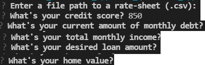
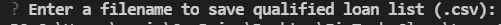

# Project Title

The loan qualifier application is a python comment-line interface program.  It interacts with users with questionaire to receive user's financial information.  Then it filters through a `daily_rate_sheet` of financial institutions. The list of qualifying loans can be saved on user's local desktop.

---

## Technologies


This project leverages python 3.7 with the following packages:

* [fire](https://github.com/google/python-fire) - For the command line interface, help page, and entrypoint.

* [questionary](https://github.com/tmbo/questionary) - For interactive user prompts and dialogs

* [sys](https://docs.python.org/3/library/sys.html) - For exit the program function exist.

* [csv](https://docs.python.org/3/library/csv.html) - For import csv file import and export

* [pathlib](https://docs.python.org/3/library/pathlib.html) -For object-oriented filesystem paths 


---

## Installation Guide

Before running the application first install the following dependencies.

```python
  pip install fire
  pip install questionary
```


---

## Usage

To use the loan qualifier app, simply clone the `loan_qualifier_app' from the respository and run **app.py** with:

```python
python app.py
```

Upon launching the loan qualifier app, you will be greated with a list of questionaire to request your financial information.



You will be prompt to save qualified loan list or not as csv to your computer.


If yes, you will be prompt for a csv filename.




---

## Contributors

Brought to you by FinTech Material and Eunice

---

## License

MIT