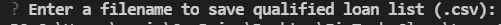

# Project Title

The loan qualifier application is a python comment-line interface program.  It interacts with users with questionaire to receive users financial information.  Then it filters through a `daily_rate_sheet` of financial institutions. The list of qualifying loans is saved on users local desktop.

---

## Technologies


This project leverages python 3.7 with the following packages:

* [fire](https://github.com/google/python-fire) - For the command line interface, help page, and entrypoint.

* [questionary](https://github.com/tmbo/questionary) - For interactive user prompts and dialogs

---

## Installation Guide

Before running the application first install the following dependencies.

```python
  pip install fire
  pip install questionary
```


---

## Usage

To use the loan qualifier app, simply clone the `loan_qualifier_app' from the respository and run **app.py** with:

```python
python app.py
```

Upon launching the loan qualifier app, you will be greated with a list of questionaire to request your financial information.


You will be prompt to save qualified loan list as csv to your computer.




---

## Contributors

Brought to you by Eunice

---

## License

MIT